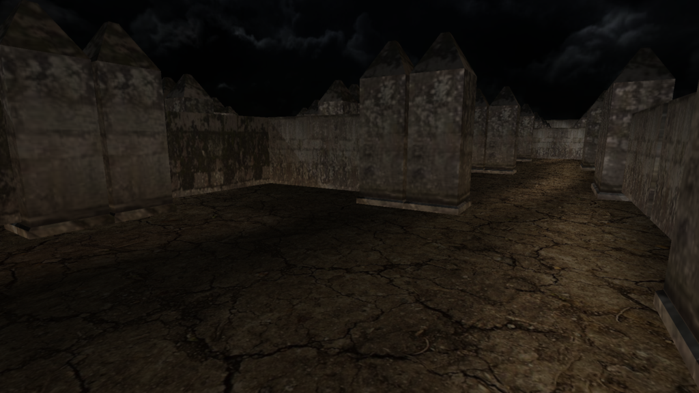
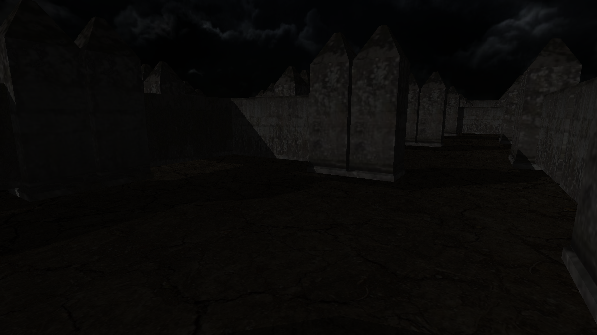
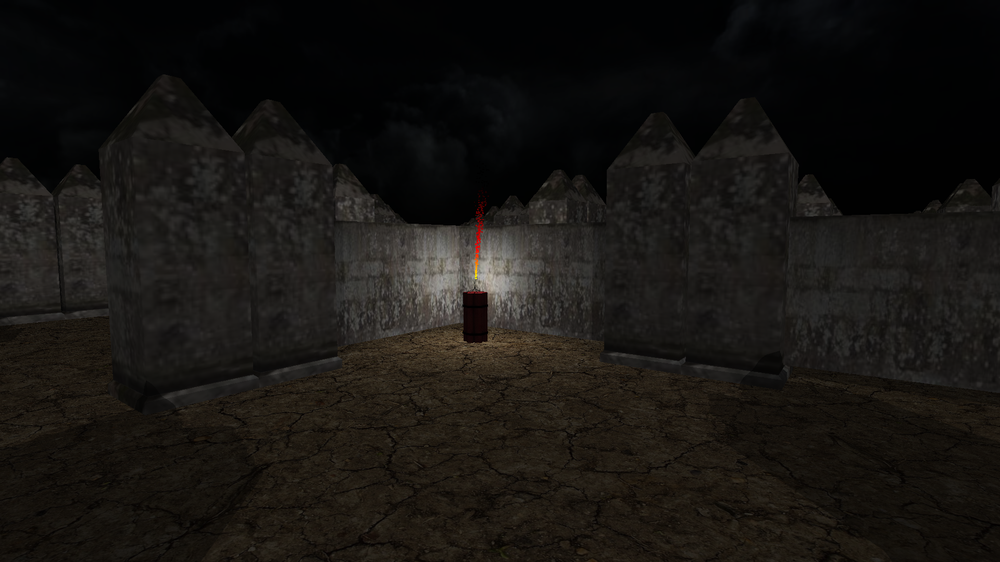
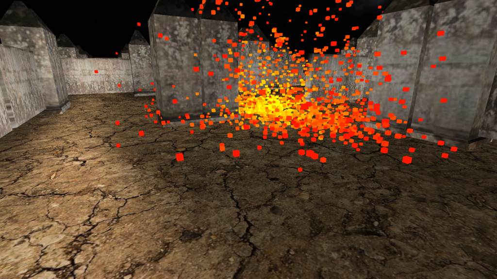
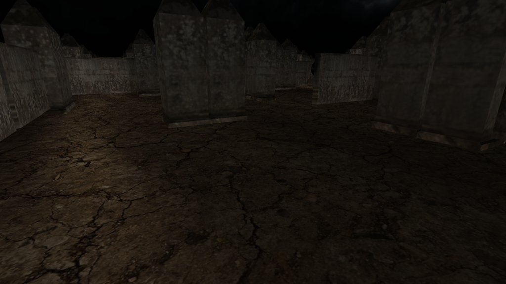

Pyromaze
=============

Pyromaze is a universal OpenGL 3.3 game engine, with a simple game implemented in it.

It features voxel cone tracing global illumination. A screenshot with global global illumation:

And a screenshot without:


By the way, the game is about blowing stuff up:





External dependencies:
-------------------------
* c++11 compiler
* OpenGL 3.3 with ```GL_ARB_shader_image_load_store```

Controls:
----------------------------------------------------
* WASD keys: position
* mouse: camera direction
* space: put down dynamite


----------------------
If you have any problem, please post in the issues tab or mail me at icyplusplus@gmail.com. Any feedback would be appreciated.

