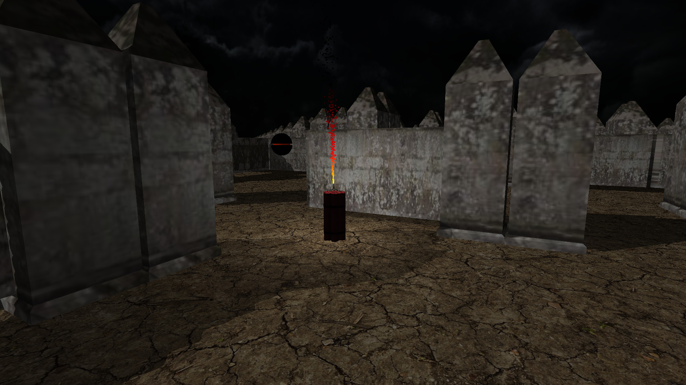

Pyromaze
=============


Pyromaze is a simple labyrinth escape game built on [Silice3D](https://github.com/Tomius/Silice3D).

The game is about blowing up walls and enemies in a labyrinth in order to escape from it:


One purpose of this game is to show that [Silice3D](https://github.com/Tomius/Silice3D) can handle pretty large scenes with a steady 60 fps, even labyrinths as big as this one:


External dependencies:
----------------------
* C++11 compiler
* OpenGL 4.5
* CMake
* Python 2

Recommended build:
------------------
```
mkdir build
cd build
cmake -DCMAKE_BUILD_TYPE=Release ..
<Open IDE project file and build> or make -j4
```

Controls:
----------------------------------------------------
* WASD keys: position
* mouse: camera direction
* space: put down dynamite


----------------------
If you have any problem, please post in the issues tab or mail me at icyplusplus@gmail.com. Any feedback would be appreciated.

